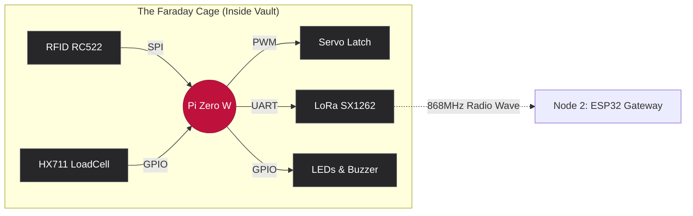

<div align="center">
  
  
  
  
  <h1>🛡️ Node 1: The Headless Edge</h1>
  <p><b>Autonomous Vault Controller & Physical State Machine</b></p>
</div>

---

## 💼 The Executive Summary (Operational Value)

**Node 1** adalah otak fisik (Dunia Bawah Tanah) dari arsitektur LoRaVault. Beroperasi 100% *offline* di dalam cangkang baja brankas, modul ini sama sekali tidak bergantung pada koneksi internet gedung. 

Tugas utamanya adalah memvalidasi identitas (*RFID*), mengukur perubahan massa aset menggunakan hukum fisika (*LoadCell*), mengontrol akses pintu (*Servo*), dan menembakkan data telemetri tersebut menembus baja menggunakan radio **LoRa 868MHz**. Node ini adalah implementasi murni dari *Zero-Trust Security*; jika seluruh jaringan pabrik lumpuh, brankas ini tetap beroperasi dan terlindungi.

---

## 🏛️ Filosofi Arsitektur (Engineering Rigor)

- **SICP (Abstraksi Barrier):** File `__init__.py` pada direktori `hardware/` dan `core/` dibiarkan KOSONG. Kesederhanaan adalah bentuk abstraksi terbaik, berfungsi murni sebagai penanda modul tanpa mencampuradukkan *global state*.
- **CLRS (Efisiensi Asimtotik):** Pembacaan sensor beban menolak penggunaan rata-rata (*mean*) yang rentan terhadap lonjakan *noise*. Sistem mengimplementasikan algoritma *Median* dengan kompleksitas $\mathcal{O}(N \log N)$ untuk membuang anomali perangkat keras secara matematis.
- **The Pragmatic Programmer (Reversibility):** DILARANG KERAS menyolder modul komputasi utama (Pi Zero, HX711, RFID) secara permanen ke PCB. Sistem wajib menggunakan *Female Pin Header* untuk memastikan *hardware swap* dapat dilakukan dalam hitungan detik.
- **DOET (Signifiers & Feedback):** 
  - Kabel internal mematuhi *Natural Mapping*: Merah = 5V, Oranye/Kuning = 3.3V, Hitam = GND.
  - Interaksi pengguna langsung dibalas secara fisik: Sukses (LED Hijau + Beep Pendek), Gagal/Anomali (LED Merah + Beep Panjang).

---

## 🧠 Hardware Topology (Data Flow)


---

## 🛠️ Cetak Biru Perangkat Keras (Perfboard / PCB Bolong)

Karena *breadboard* rentan terhadap getaran fisik (*high contact resistance*), Node 1 **wajib** dirakit di atas *Perfboard*.

### 1. Rel Daya (Power Bus)

Buat 3 jalur tembaga padat di sisi bawah PCB:

* **Rel 5V:** Terhubung ke Pin Fisik 2 atau 4 (Pi Zero).
* **Rel 3.3V:** Terhubung ke Pin Fisik 1 atau 17 (Pi Zero).
* **Rel GND (Common):** Terhubung ke Pin Fisik 6, 9, atau 39 (Pi Zero).

### 2. Distribusi Pinout (Disolder ke Rel & Header)

* **Servo MG90S:** VCC $\rightarrow$ Rel 5V | GND $\rightarrow$ Rel GND | Data $\rightarrow$ Pin 32 (GPIO 12)
* **HX711 (Timbangan):** VCC $\rightarrow$ Rel 3.3V | GND $\rightarrow$ Rel GND | DT $\rightarrow$ Pin 29 (GPIO 5) | SCK $\rightarrow$ Pin 31 (GPIO 6)
* **RFID RC522 (SPI):** 3.3V $\rightarrow$ Rel 3.3V | GND $\rightarrow$ Rel GND | RST $\rightarrow$ Pin 22 (GPIO 25) | SDA $\rightarrow$ Pin 24 (GPIO 8) | SCK $\rightarrow$ Pin 23 (GPIO 11) | MOSI $\rightarrow$ Pin 19 (GPIO 10) | MISO $\rightarrow$ Pin 21 (GPIO 9)
* **DOET Indicators:** LED Hijau $\rightarrow$ Pin 12 | LED Merah $\rightarrow$ Pin 18 | Buzzer $\rightarrow$ Pin 16 (Semua katoda diseri dengan resistor 220 $\Omega$ ke Rel GND).

### 3. Isolasi Elektromagnetik (LoRa SX1262)

Modul LoRa memancarkan *noise* RF tingkat tinggi saat transmisi, yang dapat mendistorsi pembacaan mikrovoltase pada chip HX711.

* **Aturan Penempatan:** Pasang soket LoRa sejauh 5-10 cm dari modul HX711 pada PCB.
* **Wiring LoRa:** VCC $\rightarrow$ Rel 3.3V | GND $\rightarrow$ Rel GND | TX $\rightarrow$ Pin 10 | RX $\rightarrow$ Pin 8 | M0 $\rightarrow$ Pin 15 | M1 $\rightarrow$ Pin 13.

---

## 🚀 Setup & Deployment (Systemd Daemon)

Node ini bersifat *Headless Plug-and-Play* (Krug's 1st Law). Saat listrik menyala, sistem langsung bekerja tanpa perlu monitor atau *keyboard*. Eksekusi perintah berikut via SSH:

### Langkah 1: Aktivasi Interface Perangkat Keras

```bash
sudo raspi-config
# 1. Aktifkan SPI: [3 Interface Options] -> [I4 SPI] -> [Yes]
# 2. Aktifkan UART LoRa: [3 Interface Options] -> [I6 Serial Port]
#    - Login shell accessible over serial? -> NO
#    - Serial port hardware enabled? -> YES
sudo reboot
```

### Langkah 2: Dependensi Terisolasi

```bash
sudo apt-get update
sudo apt-get install python3-pip python3-venv -y
sudo pip3 install -r /home/pi/1_pi_zero_node/requirements.txt
```

### Langkah 3: Registrasi Daemon Systemd (Auto-Start)

```bash
# Daftarkan Core Loop & Web Config
sudo cp /home/pi/1_pi_zero_node/systemd/loravault-core.service /etc/systemd/system/
sudo cp /home/pi/1_pi_zero_node/systemd/loravault-web.service /etc/systemd/system/

# Muat ulang daemon Linux
sudo systemctl daemon-reload

# Aktifkan untuk berjalan otomatis saat Pi Zero menyala
sudo systemctl enable loravault-core.service
sudo systemctl enable loravault-web.service

# Eksekusi sekarang juga
sudo systemctl start loravault-core.service
sudo systemctl start loravault-web.service

# Verifikasi (Pastikan berwarna hijau/Active)
sudo systemctl status loravault-core.service
```

---