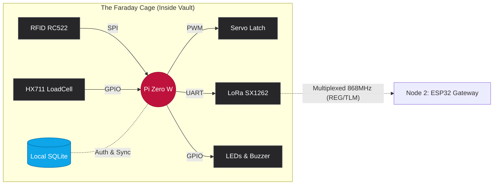

<div align="center">
  
  
  
  
  <h1>🛡️ Node 1: The Headless Edge</h1>
  <p><b>Zero-Trust Vault Controller, Offline Auth & Physical State Machine</b></p>
</div>

---

## 💼 The Executive Summary (Operational Value)

**Node 1** adalah otak fisik (Dunia Bawah Tanah) dari arsitektur LoRaVault. Beroperasi 100% *offline* di dalam cangkang baja brankas, modul ini tidak bergantung pada koneksi internet gedung. 

Pembaruan arsitektur terbaru menerapkan **Zero-Trust Security**. Node ini sekarang memiliki *database* SQLite mandiri untuk mengotentikasi kartu. Akses pintu terkunci mutlak bagi kartu yang tidak terdaftar. Node ini juga mampu melakukan *Air-Gapped Sync*, mengirimkan paket pendaftaran NIK (`REG`) dan paket telemetri massa (`TLM`) menembus beton menggunakan teknik **LoRa Multiplexing**.

---

## 🏛️ Filosofi Arsitektur (Engineering Rigor)

- **Single Source of Truth (SSOT):** Menghindari redundansi data HRD. Node 1 hanya mengaitkan UID RFID dengan NIK (Nomor Induk Karyawan) institusi. Translasi nama dan jabatan ditangani murni di level *Cloud*.
- **SICP (Abstraksi Barrier):** File `__init__.py` pada direktori `hardware/` dan `core/` dibiarkan KOSONG. Kesederhanaan adalah bentuk abstraksi terbaik, berfungsi murni sebagai penanda modul tanpa mencampuradukkan *global state*.
- **CLRS (Efisiensi Asimtotik):** 
  - *Sensor:* Mengimplementasikan algoritma *Median* dengan kompleksitas $\mathcal{O}(N \log N)$ untuk membuang anomali getaran hardware.
  - *Database:* Pencarian izin akses UID beroperasi dalam waktu $\mathcal{O}(\log N)$ memanfaatkan *Primary Key Indexing* pada SQLite.
- **DOET (Signifiers & Feedback):** Interaksi pengguna langsung dibalas secara fisik: Sukses (LED Hijau + Beep Pendek), Gagal/Ditolak (LED Merah + Beep Panjang).

---

## 🧠 Hardware Topology (Data Flow)



---

## 🪪 Panduan Operasional: Pendaftaran Akses Pegawai

Karena sistem berada di ruang kedap internet, pendaftaran kartu karyawan baru dilakukan melalui portal lokal (*Air-Gapped*).

1. **Koneksi ke Brankas:** Teknisi/Admin Keamanan menyalakan Wi-Fi di *smartphone* atau laptop dan terhubung ke Hotspot mandiri yang dipancarkan oleh Pi Zero (contoh SSID: `LoRaVault_Setup`).
2. **Akses Portal Web:** Buka *browser* dan akses alamat IP `http://192.168.4.1`.
3. **Tap & Auto-Fill:**
* Tempelkan kartu RFID baru ke area sensor di luar brankas.
* Kolom `UID Kartu` di layar *smartphone* akan terisi secara otomatis (*auto-fill*).


4. **Input Data Tunggal:** Masukkan NIK / NIM / ID Pegawai yang sah ke dalam kolom yang tersedia.
5. **Simpan & Selesai:** Tekan tombol **"Kaitkan Kartu & ID"**.
* *Hasil Lokal:* Pintu brankas kini akan mengenali dan bisa dibuka oleh kartu tersebut seketika itu juga.
* *Hasil Global:* Di belakang layar (*background*), Pi Zero akan menembakkan sinyal LoRa ke atas tanah untuk mendaftarkan NIK tersebut ke Server Pusat (*Supabase*).


---

## 🛠️ Cetak Biru Perangkat Keras (Perfboard / PCB Bolong)

Karena *breadboard* rentan terhadap getaran fisik (*high contact resistance*), Node 1 **wajib** dirakit di atas *Perfboard*.

### 1. Rel Daya (Power Bus)

* **Rel 5V:** Terhubung ke Pin Fisik 2 atau 4 (Pi Zero).
* **Rel 3.3V:** Terhubung ke Pin Fisik 1 atau 17 (Pi Zero).
* **Rel GND (Common):** Terhubung ke Pin Fisik 6, 9, atau 39 (Pi Zero).

### 2. Distribusi Pinout (Disolder ke Rel & Header)

* **Servo MG90S:** VCC $\rightarrow$ Rel 5V | GND $\rightarrow$ Rel GND | Data $\rightarrow$ Pin 32 (GPIO 12)
* **HX711 (Timbangan):** VCC $\rightarrow$ Rel 3.3V | GND $\rightarrow$ Rel GND | DT $\rightarrow$ Pin 29 (GPIO 5) | SCK $\rightarrow$ Pin 31 (GPIO 6)
* **RFID RC522 (SPI):** 3.3V $\rightarrow$ Rel 3.3V | GND $\rightarrow$ Rel GND | RST $\rightarrow$ Pin 22 (GPIO 25) | SDA $\rightarrow$ Pin 24 (GPIO 8) | SCK $\rightarrow$ Pin 23 (GPIO 11) | MOSI $\rightarrow$ Pin 19 (GPIO 10) | MISO $\rightarrow$ Pin 21 (GPIO 9)
* **DOET Indicators:** LED Hijau $\rightarrow$ Pin 12 | LED Merah $\rightarrow$ Pin 18 | Buzzer $\rightarrow$ Pin 16 (Semua katoda diseri dengan resistor 220 $\Omega$ ke Rel GND).

### 3. Isolasi Elektromagnetik (LoRa SX1262)

Modul LoRa memancarkan *noise* RF tingkat tinggi saat transmisi.

* **Aturan Penempatan:** Pasang soket LoRa sejauh 5-10 cm dari modul HX711 pada PCB.
* **Wiring LoRa:** VCC $\rightarrow$ Rel 3.3V | GND $\rightarrow$ Rel GND | TX $\rightarrow$ Pin 10 | RX $\rightarrow$ Pin 8 | M0 $\rightarrow$ Pin 15 | M1 $\rightarrow$ Pin 13.

---

## 🚀 Setup & Deployment (Systemd Daemon)

Node ini bersifat *Headless Plug-and-Play* (Krug's 1st Law). Eksekusi perintah berikut via SSH:

### Langkah 1: Aktivasi Interface Perangkat Keras

```bash
sudo raspi-config
# 1. Aktifkan SPI: [3 Interface Options] -> [I4 SPI] -> [Yes]
# 2. Aktifkan UART LoRa: [3 Interface Options] -> [I6 Serial Port]
#    - Login shell accessible over serial? -> NO
#    - Serial port hardware enabled? -> YES
sudo reboot
```

### Langkah 2: Dependensi Terisolasi

```bash
sudo apt-get update
sudo apt-get install python3-pip python3-venv sqlite3 -y
sudo pip3 install -r /home/pi/1_pi_zero_node/requirements.txt
```

### Langkah 3: Registrasi Daemon Systemd (Auto-Start)

```bash
# Daftarkan Core Loop & Web Config
sudo cp /home/pi/1_pi_zero_node/systemd/loravault-core.service /etc/systemd/system/
sudo cp /home/pi/1_pi_zero_node/systemd/loravault-web.service /etc/systemd/system/

# Muat ulang daemon Linux & Aktifkan
sudo systemctl daemon-reload
sudo systemctl enable loravault-core.service
sudo systemctl enable loravault-web.service

# Eksekusi sekarang juga
sudo systemctl start loravault-core.service
sudo systemctl start loravault-web.service
```