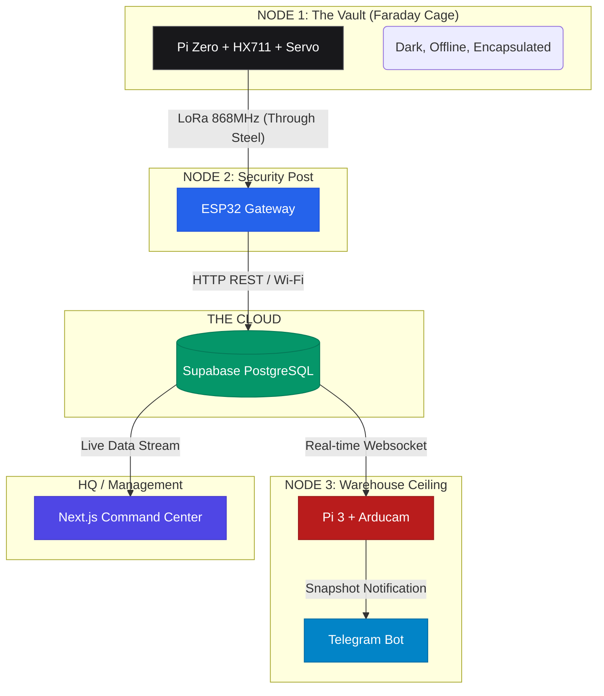

<div align="center">
  
  
  
  
  
  <h1>🛡️ LoRaVault</h1>
  <p><b>Automated Smart Asset Management & Hybrid-Mesh Security System</b></p>
  <p><i>"We don't sell iron safes. We sell Zero-Trust Operational Efficiency."</i></p>
</div>

---

## 💼 The Executive Summary (For CEO & CFO)

Di dunia industri berat (Tambang, Farmasi, Manufaktur, Data Center), kehilangan aset operasional kritis sering kali bukan disebabkan oleh pembobolan eksternal, melainkan **"Silent Shrinkage"** (pencurian internal) dan sistem pencatatan kertas yang rentan dimanipulasi. 

**LoRaVault** mendisrupsi sistem gembok tradisional. Ini adalah **Admin Gudang Robotik**. Sistem ini mengotomatisasi pencatatan inventaris secara absolut menggunakan hukum fisika (sensor beban presisi miligram) dan mencegah manipulasi data tanpa memerlukan campur tangan manusia. 

### 📈 Core Business Values
1. **Zero Human Error:** Pegawai menempelkan kartu ID, mengambil alat, dan menutup pintu. Sistem otomatis mencatat *Siapa* meminjam *Apa*, dan *Kapan*. Mengeliminasi 100% birokrasi kertas.
2. **Asuransi Anti-Orang Dalam (Audit Trail):** Kamera AI tersembunyi memotret wajah pelaku tepat di sepersekian detik anomali berat terjadi (mengeliminasi *"Indiana Jones Vulnerability"* / menukar alat mahal dengan batu).
3. **Infrastruktur Tahan Banting (Resilience):** 100% kebal terhadap sabotase Wi-Fi, pemadaman *router*, dan *blank-spot* ruang bawah tanah berkat transmisi radio LoRa militer-grade yang menembus baja.

---

## 🏗️ System Architecture (For CTO & Engineers)

LoRaVault dibangun dengan filosofi **Absolute Orthogonality** dan **Decoupling**. Kami memisahkan sistem menjadi 3 Node fisik dan 1 Cloud Brain untuk menghilangkan *Single Point of Failure* dan ancaman *Umbilical Cord Sabotage* (sabotase kabel).



### 🚀 Key Technological Innovations

* **$\mathcal{O}(N \log N)$ Hardware Noise Filtering:** Algoritma Median Filter di Edge Node menolak lonjakan *noise* elektromagnetik secara matematis.
* **Zero-Drill "Faraday" Escapement:** LoRa 868MHz bertenaga tinggi menembus dinding baja brankas tanpa memerlukan satu lubang kabel pun yang bisa dipotong maling.
* **The $\mathcal{O}(1)$ Sniper Camera:** Mengganti pencarian video CCTV 24 jam ($\mathcal{O}(N)$) dengan *Event-Driven Snapshot* ($\mathcal{O}(1)$) tepat saat database mendeteksi selisih beban.

---

## 🗂️ Polyglot Microservices Directory

Proyek ini adalah *Monorepo*. Setiap *folder* beroperasi secara independen. **Klik pada nama direktori untuk melihat dokumentasi teknis (Wiring/Hardware) masing-masing Node.**

| Directory | Role | Stack | Description |
| --- | --- | --- | --- |
| **[`1_pi_zero_node/`](https://www.google.com/search?q=./1_pi_zero_node)** | **The Brain & Lock** | Python 3, Flask | Berada di DALAM brankas. Membaca LoadCell, Servo, RFID, dan pemancar LoRa. |
| **[`2_esp32_gateway/`](https://www.google.com/search?q=./2_esp32_gateway)** | **The Bridge** | C++, PlatformIO | Berada di POS SATPAM. Mengubah sinyal radio LoRa menjadi HTTP REST payload. |
| **[`3_ai_camera_pi3/`](https://www.google.com/search?q=./3_ai_camera_pi3_desktop)** | **The Eye** | Python, Tkinter | Berada di PLAFON Gudang. Bereaksi terhadap Websocket Supabase & mengirim Telegram. |
| **[`4_supabase_sql/`](https://www.google.com/search?q=./4_supabase_sql)** | **The Math Engine** | PostgreSQL | Logika Bisnis (*State Machine*), Indeks B-Tree, dan Row Level Security (RLS). |
| **[`5_dashboard_nextjs/`](https://www.google.com/search?q=./5_dashboard_nextjs)** | **Command Center** | Next.js, Tailwind | Dasbor eksekutif *Real-Time*. Dibangun mematuhi hukum UI *Krug's Don't Make Me Think*. |

---

## 🏁 Quick Start: Deployment from Zero

Panduan ini dikhususkan untuk membangun **Cloud Brain (Supabase)** dan **Command Center (Next.js)**. *(Untuk perakitan hardware, silakan masuk ke folder Node 1, 2, dan 3).*

### Phase 1: Setup The Cloud Brain (Supabase)

Sistem ini menggunakan Supabase sebagai *Database* dan *Realtime Message Broker*.

1. Buat akun gratis di [Supabase.com](https://supabase.com) dan buat **Project Baru**.
2. Masuk ke menu **SQL Editor**.
3. Buka folder `4_supabase_sql/` di repositori ini. *Copy-paste* isi file secara berurutan dan tekan **Run**:
* `01_schema.sql` (Membuat tabel & relasi).
* `02_functions_triggers.sql` (Membuat otomatisasi peminjaman fisik).
* `03_rls_policies.sql` (Mengunci keamanan *Zero-Trust*).


4. Pergi ke **Project Settings -> API**. Salin `Project URL` dan `anon/public key`. Anda akan membutuhkannya.

### Phase 2: Local Development (Test di Laptop)

Pastikan Anda memiliki [Node.js](https://www.google.com/search?q=https://nodejs.org/) terinstal.

1. Buka terminal, masuk ke folder dasbor:
```bash
cd 5_dashboard_nextjs
npm install
```


2. Buat file bernama `.env.local` di dalam folder `5_dashboard_nextjs` dan tempel kredensial Supabase Anda:
```env
NEXT_PUBLIC_SUPABASE_URL="https://[PROJECT-ID].supabase.co"
NEXT_PUBLIC_SUPABASE_ANON_KEY="eyJh..."
```


3. Jalankan server lokal:
```bash
npm run dev
```


4. Buka `http://localhost:3000`. Dasbor Anda sudah hidup!

### Phase 3: Production Deployment (Vercel)

Untuk meluncurkan Dasbor Eksekutif ke internet (Live) dalam 3 menit:

1. Pastikan seluruh repositori ini sudah Anda dorong (*Push*) ke akun **GitHub** Anda.
2. Login ke [Vercel.com](https://www.google.com/search?q=https://vercel.com) menggunakan GitHub.
3. Klik **Add New -> Project** dan *Import* repositori ini.
4. Pada bagian **Root Directory**, klik Edit dan pilih `5_dashboard_nextjs`.
5. ⚠️ **PENTING:** Buka dropdown **Environment Variables**, masukkan 2 kunci `.env.local` Anda (URL dan Key Supabase) lalu klik *Add*.
6. Klik **Deploy**. Selesai! URL Command Center Anda siap dipresentasikan.

---

## 🧠 Software Engineering Principles

Proyek ini tidak ditulis secara serampangan. Setiap baris kode dikawal ketat oleh 4 Kitab Suci Rekayasa Perangkat Lunak:

* **Steve Krug's "Don't Make Me Think":** Antarmuka (Next.js & Tkinter) dirancang brutal, jelas, memprioritaskan tipografi tebal, dan meminimalkan beban kognitif (Tidak ada istilah teknis rumit untuk pengguna akhir).
* **SICP (Structure and Interpretation of Computer Programs):** Abstraksi prosedural yang ketat. Logika perangkat keras (Edge) dipisah absolut dari logika bisnis (Cloud).
* **The Pragmatic Programmer:** Konfigurasi dipisahkan dari kode (*Decoupling*), desain *Fail-Fast* pada integrasi *hardware*.
* **CLRS (Introduction to Algorithms):** Pemilihan algoritma kompleksitas $\mathcal{O}(1)$ untuk *event firing* dan $\mathcal{O}(\log N)$ untuk arsitektur *database* menjamin sistem tidak akan pernah mengalami *bottleneck*.